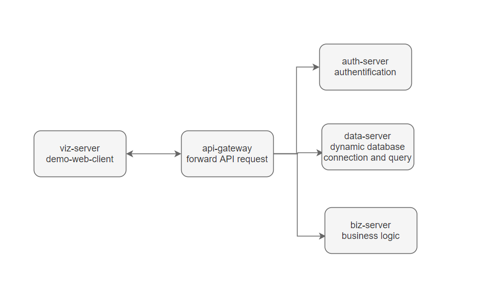

# Ubiquitous Alchemy 

## Why Ubiquitous Alchemy?
Ubiquitous Alchemy provides different services for the [Cyberbrick](https://github.com/Jacobbishopxy/cyberbrick) project such as authentification service and ETL service. Those services have separated logic from each other and the front-end. If all are integrated with a single service, a minor update would affect the whole service. To better manage different services, we put them as different microservices. In this case, refactoring one microservice wouldn't affect other running microservices. 

## Ubiquitous-Alchemy Project Structure



## ubiquitous-api-gateway

An API gateway sits between clients and services. It acts as a reverse proxy, routing requests from clients to services. It may also perform various cross-cutting tasks such as authentication and data persistence. Without a gateway, clients must send requests directly to front-end services. This may result in complex client code and coupling client and backend code. A gateway helps to address these issues by decoupling clients from services. [source](https://docs.microsoft.com/en-us/azure/architecture/microservices/design/gateway)

ubiquitous-api-gateway is based on [lura](https://github.com/luraproject/lura), an open framework to assemble ultra performance API Gateways with middlewares; formerly known as KrakenD framework. 

ubiquitous-api-gateway reads a [KrakenD's configuration file](https://www.krakend.io/docs/configuration/overview/). The configuration file needs to be a JSON file. The main structure of the config file is:
```json
    {
        "version": 2,
        "endpoints": [],
        "extra_config": {}
    }
```
`version`: The version of the KrakenD file format.
Version 2: current version
Version 1: Deprecated in 2016, for version v0.3.9 and older.
`endpoints[]`: An array of endpoint objects offered by the gateway and all the associated backends and configurations. This is your API definition.
`extra_config{}`: Components' configuration. Whatever is not a core functionality of the Lura Project is declared in a unique namespace in the configuration, so that you can configure multiple elements without collisions.

In production mode, ubiquitous-api-gateway is a binary executable file. It takes in the following flags as arguments:
-p  "Port of the service"
-l  "Logging level"
-d  "Enable the debug"
-c  "Path to the configuration filename"

## ubiquitous-auth-server

ubiquitous-auth-server provides an authentification service that could handle user registration, login, and logout. 

Its [api](./../ubiquitous-auth-server/README.md) includes taking user's information for registration, sending an email invitation, handling invitation's confirmation, allowing registered users to log in, and logout.

1. Invitation
   The invitation request data is of the form:
```rust
   pub struct InvitationReq {
    pub nickname: String,
    pub email: String,
    pub password: String,
}
```
When receives an invitation request, auth-server first hashes the user password with `util/encription_helper.rs`. It then creates a new `Invitation` instance, with the user role default to 'visitor', and persists the invitation to the database. It then sends the invitation email through an `emailService` instance. The invitation email contains the invitation id as a parameter.

2. Registration
   A user will only be registered after this API. When a client sends a request with invitation id as a parameter, auth-server will confirm a user's invitation id & email, and then register the user. To confirm the invitation, auth server checks whether the invitation is in the database and whether the invitation is expired. In case of a user sends several invitation request, auth-server will only consider the latest request. If the invitation is valid, copy user registration info from the `invitation` table and save it to the `user` table. After saving information to the `user` info, the whole registration process finishes.

3. Login & Logout
   auth-server handles user login and logout with cookies. 
   1. When receives a login request, the auth-server leaves the client a cookie that contains the user's info. It first checks whether the user exists in the user table. If not, it verifies the password using `encryption_helper.rs` (notice that the password in the database is hashed while the password received from the client is not). If the password is valid, serializing user info to string and setting cookies.
   2. To prevent unnecessary login, auth-server also provides an API to check whether the user is logged in with cookies.
   3. To log a user out, simply "delete" the cookies.

## [ubiquitous-data-server](../ubiquitous-data-server/README.md) 
ubiquitous-data-server is the data layer, data engine and data cache based on deps below:

   - [dyn-conn](https://github.com/Jacobbishopxy/rustopia): provides dynamic SQL connection and execution

   - [sqlz](https://github.com/Jacobbishopxy/rustopia): SQL AST model

   - [tiny-df](https://github.com/Jacobbishopxy/rustopia): custom data structure, gluing third party crates

   - [xlz](https://github.com/Jacobbishopxy/rustopia): xlsx/xml toolkit

   - Other 3-rd party dependencies:

     1. [actix-web](https://github.com/actix/actix-web): Rust Http service
     2. [serde](https://github.com/serde-rs/serde): JSON (de)serialize
     3. [sea-query](https://github.com/SeaQL/sea-query): SQL string generator
     4. [sqlx](https://github.com/launchbadge/sqlx): SQL connector & executor
     5. [rbatis](https://github.com/rbatis/rbatis): Database ORM
   
   ### Project Structure
   1. ua-application
      - `main`: read env file, start the data persistence service if the server is not offline, serving http requests and routes http request to controller, configuration, query, or schema service.
      - `controller`: Map Http routes to corresponding configuration, query, or schema services
      - `service`: Integrating business logic's implementation. The implementation that is exposed to controller.
      - `error`: ua-applications error handling. Define the errors for http response. Errors are Dao error, Dao not found, Dao repetitive initialize, Internal Server Error, and Bad Request. 
      - `constant`: read env file variables and check the validation of env file. Env file should contain variable `URI`, `SERVICE_HOST`, and `SERVICE_PORT`.
      - `model`: business integration & data persistence. 
      For business integration, declare a `pub struct CI(ConnectionInformation);` and implements the following methods for CI:
         `new()` new a CI instance with a connection string as parameter.
         `ci()`: clone a CI
         `ConnInfoFunctionality`: convert CI to `ConnInfo`
      Declare a `pub struct UaConn(DaoOptions);` and implements the following methods for UaConn:
         `BizPoolFunctionality`: disconnect from the database.
         `ConnGeneratorFunctionality`: create a connection or check whether the pool is connecting
      For connection data persistence, declare a `pub struct UaPersistence(PersistenceDao);` and implements:
         `UaPersistence`: create a new connection (with optional table initialization).
         `PersistenceFunctionality`: load all connection information from database, save connection, update connection, or delete connection.

   1. ua-persistence:

      - `model`: serves for data persistence. It defines the Rust data structure to process the data, provides SQL schema initialization, and can perform SQL query or mutation. It can insert, update, load, or delete single info or all info from the database.  
  
   1. ua-service:

      - `dao`: database access object. The object is defined as
      ```rust
      pub struct Dao<T: Database> {
         pub info: String,
         pub pool: Pool<T>,
      }
      ```
      `Database` now supports PostgreSQL and MySQL. 
      `info`: connection string
      `pool`: connection pool

      `Dao`'s method:
          `Clone()` that can clone a information.
           `new()` initialize a new database access
           `connectable()` check whether current object is connectable
      - `error`: error handler. Error includes database general error(worker crashed & migration error), database connection (pool time out & pool closed), error, and database operation error (index out of bound error & column decode error). 
      - `interface`: business logic's interface. Define all the features that serve to implement the business logic.
      - `repository`: business logic's implementation. Implement the corresponding method declared in the `interface`. Methods include fetch all table names or all column names of a given table; create, alter, truncate or drop tables; create or drop indexes; create or drop foreign indexes.
      - `provider`: SQL string generator. Generate SQL string for operations including list all columns or all tables' name; create, alter, drop, rename, or truncate a table; create or drop an index; create or drop a foreigh key; select given columns from a given table with given conditions.
      - `util`: utilities. Miscellaneous helper function

## ubiquitous-viz-server
ubiquitous-viz-server is the visualization demo of ubiquitous-alchemy application. It's a web client supporting user interaction with backend ubiquitous alchemy server. Servers that give API support are ubiquitous-data-server, ubiquitous-auth-server, and ubiquitous-api-gateway.

In dev mode, ubiquitous-viz-server's frontend we need to config `package.json` property `proxy` to the api-gateway host (eg: "http://localhost:8080"). 

The web client is defined in `frontend`. Based on `React`, it's a single page web-app. 

With `react-router-dom`, map url paths to components. 

### Http Services
In `./servers`, define the Http API for database configuraion, selection configuration, and authentification. All APIs are mapped to ubiquitous-api-gateway, without worrying which server will actually handle the service logic. Here, we use `axios` to send HTTP request.

### Modal
In `./services/API.d.ts`, defines all the data type used for `datalab`, `querySelector`, and authentifictaion. 

### React Components
Using `antd`'s `layout`, define the App header, footer, and breadcrumb from `components/AppAccessory`. Brandcrumb is dynamically generated with current url path. We can get the current url path from `props.location.pathname`. Header consists of links to datalab and query selector. Right hand side of the header links to login/logout pages. 

- `Datalab` is the web client for ubiquitous-data-server. It contains a reusable modal form for editing database connection information. Field `name`, `driver`(db type), `username`, `password`, `host`, `port`, and `database` are required. `description` is optional.
The main component of `Datalab` is an antd `ProTable`. The columns are generated by `columnsFactory`. Each column is editable and deletable. Each column implements the `check connection` api, that can check database connection with column's info as connection info. When updating column, the modal form contains column's info as default value. When inserting a new column, the modal form doesn't have default value.

- `QuerySelector` is a complex modal form that allow user to perform database query. The value of the form will be converted to data type
   ```js
   interface Selection {
         table: string,
         columns: ColumnAlias[],
         filter?: Expression[],
         order?: Order[],
         limit?: number,
         offset?: number,
      }
   ```
   `table` is a single selection while `columns` are the column names of the selected `table`.  `SelectionFilter` is an optional two-layer list. A filter list can be a list of filter list, or the condition item. For exmaple, `filter=[condition item1, condition item2, filter list1=[sub-cond1, sub-cond2]]`. Condition item consists of condition value and condition type
   ```js
   enum conditionEnum {
      Equal = "=",
      NotEqual = "!=",
      Greater = ">",
      GreaterEqual = ">=",
      Less = "<",
      LessEqual = "<=",
      In = "in",
      Between = "between",
      Like = "like",
   }
   ```
   Notice that for "Between" we have a pair of input box; for "In" we have a multi-input box; And for the remaining conditions we use a text input box.

   `Order` is the order of selecting data, `limit` and `offset` is used to select certain amount of data.

- `Login` defines the `login`, `logout`, `registration`, and `invitation` page. It's the web client for `ubiquitous-auth-server`. 
  `login` and `registration` page are forms for inputing user login/registation needed data. 
  `Registration` page will validate the input before sending http request. Password needs at least 6 characters. 
  `Invitation` page is the page when a user click the invitation link in the invitation email. `Invitation` page reads the url path query. If query is empty it will prompt user to re-register. If query is valid, user should click the confirm button and being redirect to login page. 
  `login` page takes user email and password, when user submits the form and API responses 'ok', it'll redirect user to the home page. Otherwise, user has to stay on the login page.
  `logout` page shows the loading state of logging out or success state of logging out.

- `App` has a react state for user logined state. Users' login or logout action will change the `isLogined` state. `App` will `check` the current login state whenever `isLogined` state is changed by sending a `check` request with cookies. 

## ubiquitous-fs-server
TODO

## ubiquitous-tg-server
TODO

## docker
`./docker` contains dockerFile to deploy an application on docker. 

### Why docker?
Developing apps today requires so much more than writing code. Multiple languages, frameworks, architectures, and discontinuous interfaces between tools for each lifecycle stage create enormous complexity. Docker simplifies and accelerates your workflow while giving developers the freedom to innovate with their choice of tools, application stacks, and deployment environments for each project. ([source](https://www.docker.com/why-docker))

### docker-go, docker-rust
The base image for actual docker image of application. Whenever we update an application, we only update the business logic of such application. If we didn't change the dependencies of such an application, we should avoid rebuilding dependencies when we re-deploy the application. Thus, we separate part of the application as a Base image and build the remaining business logic image from the Base image.
`docker-go` is the image for `golang`.
`docker-rust` is the image for `rust`.

### docker-api-gateway & docker-auth-server
Contains all the files needed to build an app image and start a container. Each folder contains two bash files: setup.sh and start.sh. Literally, setup.sh is used to set up the app image while start.sh is used to start a container. Two bash files will read the env variable from the `./resources` folder.

## resources
Contains the env files for different servers. This is for keeping environment variables consistent and protect information. The actual env file will not upload to remote github repo. Instead, a template env file is provided, and users can config the env file with their own information such as database-connection information.